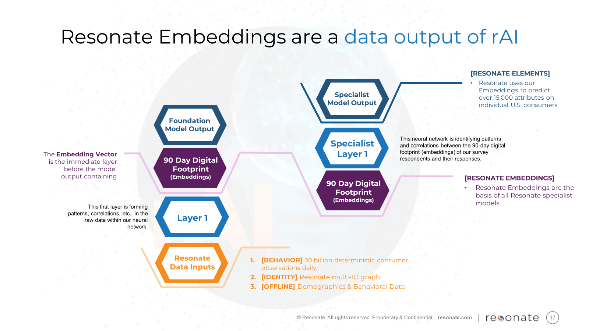
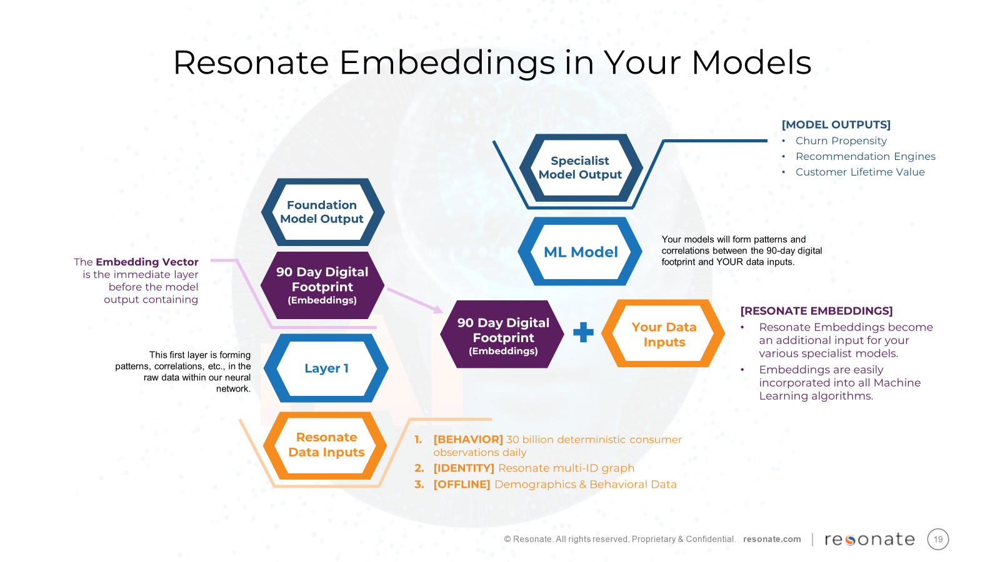

# Embeddings Cookbook

This repository contains code examples for running machine learning models using Resonate Embeddings as features. It includes examples for training models with optuna and scikit-learn.

## Overview

Embeddings or Embedding Vectors or Vector Embeddings are mathematical representations of a large data set in a meaningful and condensed form. They preserve the patterns and relationships within the data to make it easier for AI to process, understand, and deliver outcomes.
Resonate Embeddings are a compressed, efficient data set of 90 days deterministic digital footprint outside of your firewalls. It’s provided at an individual level, in a secure, privacy-safe solution. Resonate’s Embeddings are proven to be highly predictive of consumers’ future behavior.
Resonate’s data base is representative of the entire U.S. consumers’ past and present.
Your team will take Resonate Embeddings, Layer on First-Party data, and create Specialist Model Outputs to drive accuracy and additional scale.


## Getting Started

Inside Resonate's AI (rAI) are a series of models - the Resonate Consumer Behavioral Foundation Model and Resonate Elements Specialist Model. The inputs to the Resonate Consumer Behavioral Foundation Model are vast sums of behavioral, demographic and identity data. We use these embeddings in other models that are neural networks, gradient boosting, segmentation, etc.
Resonate Embeddings may be used as an additional input for your own internal ML models. This repository contains useful code for getting started with a variety of familiar ML models and processes. You'll find they're easily incorporated into all Machine Learning algorithms.




### Prerequisites

Ensure you have the following Python packages installed:

- sklearn
- optuna (for hyperparameter optimization)
- Any other dependencies required by your scripts

### Installation

Clone this repository:

```bash
git clone https://github.com/resonate/resonate-embeddings-cookbook.git
cd embeddings-cookbook
```

Install the necessary Python packages:

```bash
pip install -r requirements.txt
```

## Usage

### Scikit-learn Example

To run the scikit-learn model:

```bash
python -m sklearn_cookbook.train_sklearn \
  --input-path {input_data} \
  --output-path {output_path} \
  --evkey {evkey} \
  --embeddings-path {embeddings_path} \
  --feature-selection False
```

### Example Values

- `input_path`: Path to the input data (local or S3), containing labels and IDs.
- `embeddings_path`: Path to the embeddings (local or S3), containing IDs and N-dimensional embeddings.
- `output_path`: Path to write the output data (local or S3).
- `evkey`: An example key, e.g., `E205932615`. This is a model identifier and needed for record keeping.
- `evaluations`: Number of evaluations for Optuna to explore the hyperparameter space (e.g., 150, but can be higher or lower).

## Input Requirements

### Input Path

This file contains the label matrix for a binary classification model. The schema for this file is:

- `rid`: ID for each data point.
- `evkey`: A model identifier to facilitate good governance of experiments and model use cases.
- `label`: Binary label indicating whether there was churn or not.

### Embeddings Path

This file contains the embeddings for a set of rids. The schema for this file is:

- `rid`: ID for each data point.
- `bottleneck`: 512-dimension embedding vector as a numpy array.

## Contributing

We welcome contributions to this project. Please submit a pull request or open an issue to discuss any changes.

## License

This project is licensed under the BSD-3-Clause License - see the LICENSE file for details.
